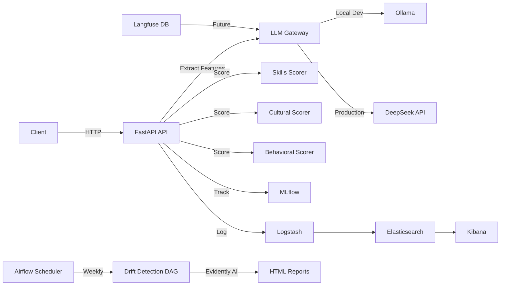

# Datathon Machine Learning Engineering

[](https://youtu.be/v03U9tBDizg)
[]()
[]()
[]()

Clique no badge acima ou no link abaixo para assistir à apresentação do projeto:

🔗 [Apresentação no YouTube](https://youtu.be/v03U9tBDizg)

---

## 📋 Índice

- [Contexto](#contexto)
- [Desafios da Empresa](#desafios-da-empresa)
- [Objetivo do Projeto](#objetivo-do-projeto)
- [Solução Proposta](#solução-proposta)
- [Arquitetura](#-arquitetura)
- [Quick Start](#-quick-start)
- [Serviços & URLs](#-serviços--urls)
- [Documentação](#-documentação)
- [Estrutura do Projeto](#-estrutura-do-projeto)
- [Tecnologias Utilizadas](#tecnologias-utilizadas)
- [MLOps Stack](#-mlops-stack)
- [Roadmap](#-roadmap)
- [Como Executar](#como-executar)
- [Monitoramento e Testes](#monitoramento-e-testes)

---

## Contexto

Este projeto foi desenvolvido como parte do **Datathon Pós Tech**, com o objetivo de aplicar Inteligência Artificial para solucionar desafios reais de uma empresa do setor de bodyshop e recrutamento, a **Decision**. A empresa busca otimizar o processo de recrutamento e seleção, conectando talentos qualificados às necessidades dos clientes, principalmente no setor de TI, onde agilidade e precisão no "match" entre candidatos(as) e vagas são essenciais.

O projeto evoluiu de um **protótipo inicial** para uma **plataforma MLOps avançada** com monitoramento de drift, orquestração de pipelines e gestão de prompts LLM.

## Desafios da Empresa

- ❌ Falta de padronização em entrevistas, gerando perda de informações valiosas
- ❌ Dificuldade em identificar o real engajamento dos candidatos(as)
- ❌ Necessidade de alinhar habilidades técnicas, fit cultural e motivação dos candidatos(as) às vagas
- ❌ Processo manual e pouco escalável para encontrar o(a) candidato(a) ideal em tempo hábil

## Objetivo do Projeto

Desenvolver uma solução baseada em IA para automatizar e aprimorar o processo de recrutamento, propondo algoritmos e ferramentas que:

- ✅ Padronizem e otimizem entrevistas
- ✅ Identifiquem padrões de candidatos(as) de sucesso
- ✅ Realizem o "match" entre perfis e vagas de forma eficiente e baseada em dados
- ✅ Disponibilizem o modelo de forma produtiva via API
- ✅ Monitorem drift e degradação do modelo automaticamente
- ✅ Gerenciem prompts LLM com versionamento

## Solução Proposta

A solução contempla uma **plataforma MLOps completa** com:

### Core ML Pipeline

- **Pipeline completo de Machine Learning**: feature engineering, pré-processamento, treinamento, validação e salvamento do modelo
- **Ensemble de modelos**: Skills Scorer, Cultural Scorer, Behavioral Scorer
- **LLM-based extraction**: Análise de currículos e descrições de vagas usando Ollama/DeepSeek

### Deployment & Serving

- **API FastAPI**: endpoint `/predict` para scoring de candidatos
- **Docker Compose**: stack completo com 9+ serviços
- **LLM Adapter Pattern**: Suporte para LLMs locais (Ollama) e cloud (DeepSeek)

### MLOps & Observability

- **Apache Airflow**: Orquestração de DAGs para drift monitoring
- **Evidently AI**: Detecção automática de drift de dados
- **MLflow**: Tracking de experimentos e modelos
- **ELK Stack**: Logs centralizados (Elasticsearch, Logstash, Kibana)
- **Langfuse**: Gestão de prompts LLM (configurado, integração pendente)

### Exemplos de Casos de Uso

- Agente de IA para entrevistas automatizadas, utilizando dados históricos para simular o papel do entrevistador
- Otimização do processo de entrevistas, aprendendo padrões de sucesso em candidatos(as) anteriores
- Identificação de atributos-chave em candidatos(as) de sucesso via algoritmos de clusterização
- **Monitoramento semanal de drift** para detectar degradação do modelo
- **Scoring automático** de candidatos via API REST

---

## 🏗️ Arquitetura

### Diagrama da Solução - Cenário 0 (Fase 2 - Desenvolvimento Local)



### Decisões Arquiteturais

Consulte **[ADR-0: Architecture Evolution](docs/ADR-0.md)** para detalhes sobre:

- ✅ **Fase 1**: LLM Adapter Pattern (Decoupling) - **COMPLETA**
- ✅ **Fase 2**: Drift Monitoring (Airflow + Evidently) - **COMPLETA**
- 🔜 **Fase 3**: Immutable Payload (Zero-Shot Learning) - **PLANEJADA**

---

---

## ⚠️ Dependências Críticas

> [!IMPORTANT]
> **Cadastro de Vagas (job_id)**: Para o correto funcionamento do scoring, é **imprescindível** que os `job_id`s consultados estejam previamente cadastrados e processados na base de dados (Feature Store).
>
> **Retreino de Modelos**: A performance do modelo depende da atualização constante dos dados. É **necessário** que o DAG de retreino (`weekly_retraining`) seja executado semanalmente para incorporar novas vagas e perfis ao espaço vetorial e aos modelos comportamentais.

## 🚀 Quick Start

### Pré-requisitos

- Docker & Docker Compose
- **GPU NVIDIA GTX 4060** (ou superior) para rodar Ollama local OU chave API DeepSeek
- 8GB+ RAM (16GB recomendado para Ollama local)
- Ollama instalado localmente (se usar LLM local)

### 1. Clone e Configure

```bash
git clone https://github.com/seu-usuario/datathon-mlet03.git
cd datathon-mlet03

# Configure variáveis de ambiente
cp .env.example .env
# Edite .env para definir LLM_PROVIDER (ollama ou deepseek)
```

### 2. Inicie os Serviços

```bash
cd infrastructure/local
docker-compose up -d
```

**Aguarde ~2 minutos para todos os serviços inicializarem.**

### 3. Verifique os Serviços

```bash
docker-compose ps
```

Todos os serviços devem mostrar status `Up`.

### 4. Teste a API

```bash
curl -X POST http://localhost:8000/predict \
  -H "Content-Type: application/json" \
  -d '{
    "resume_text": "Desenvolvedor Python com 5 anos de experiência em FastAPI e Docker",
    "job_description": "Vaga para desenvolvedor backend Python sênior"
  }'
```

---

## 🌐 Serviços & URLs

### Serviços de Produção

| Serviço | Porta | URL | Credenciais | Descrição |
|---------|-------|-----|-------------|-----------|
| **API** | 8000 | <http://localhost:8000> | - | Endpoint de scoring |
| **MLflow** | 5000 | <http://localhost:5000> | - | Tracking de experimentos |
| **Kibana** | 5601 | <http://localhost:5601> | - | Visualização de logs |
| **Elasticsearch** | 9200 | <http://localhost:9200> | - | Armazenamento de logs |

### Serviços MLOps

| Serviço | Porta | URL | Credenciais | Descrição |
|---------|-------|-----|-------------|-----------|
| **Airflow** | 8080 | <http://localhost:8080> | admin / admin | UI de gerenciamento de DAGs |
| **Langfuse** | 3000 | <http://localhost:3000> | (setup necessário) | Gestão de prompts LLM |

---

## 📚 Documentação

### Documentação Principal

| Documento | Descrição | Link |
|-----------|-----------|------|
| **ADR-0** | Decisões arquiteturais e roadmap | [docs/ADR-0.md](docs/ADR-0.md) |
| **API Reference** | Documentação dos endpoints | [docs/api_reference.md](docs/api_reference.md) |
| **Data Architecture** | Padrão Medallion, gestão de PII | [docs/data_architecture.md](docs/data_architecture.md) |
| **Feature Engineering** | Análise de features e pipeline | [docs/feature_engineering_analysis.md](docs/feature_engineering_analysis.md) |

### Decisões Técnicas

| Documento | Descrição | Link |
|-----------|-----------|------|
| **Model Decisions** | Escolha e justificativa dos modelos | [docs/model_decisions.md](docs/model_decisions.md) |
| **Technical Decisions** | Decisões de stack tecnológico | [docs/technical_decisions.md](docs/technical_decisions.md) |
| **Drift Detection Tools** | Comparação: Evidently vs Deepchecks vs Whylogs | [docs/drift_detection_tools.md](docs/drift_detection_tools.md) |

### Resultados de Experimentos

| Documento | Descrição | Link |
|-----------|-----------|------|
| **Experiment Summary** | Métricas de performance dos modelos | [docs/experiment_summary.md](docs/experiment_summary.md) |
| **Pipeline Health** | Qualidade de dados e relatórios de drift | [docs/experiment_results_and_pipeline_health.md](docs/experiment_results_and_pipeline_health.md) |

### Infraestrutura

| Documento | Descrição | Link |
|-----------|-----------|------|
| **Infrastructure README** | Setup local vs cloud | [infrastructure/README.md](infrastructure/README.md) |
| **DAGs README** | Documentação das DAGs do Airflow | [dags/README.md](dags/README.md) |

---

## 📁 Estrutura do Projeto

```
datathon-mlet03/
├── infrastructure/          # Configurações de deployment
│   ├── local/              # Stack Docker Compose
│   │   ├── docker-compose.yml    # Todos os serviços
│   │   ├── Dockerfile            # API service
│   │   ├── Dockerfile.airflow    # Airflow customizado
│   │   ├── requirements-airflow.txt
│   │   ├── config/               # Configs do Logstash
│   │   └── airflow/              # Logs e plugins
│   └── cloud/              # Terraform (futuro)
│
├── dags/                   # DAGs do Airflow
│   ├── drift_monitoring.py       # Drift check semanal
│   └── utils/
│       └── drift_detection.py    # Helpers do Evidently
│
├── data_pipeline/          # Pipeline de ML
│   ├── pipe/
│   │   ├── features/       # Feature engineering
│   │   ├── scoring/        # Modelos de scoring
│   │   └── training/       # Treinamento
│   ├── infra/
│   │   └── llm_gateway.py  # LLM Adapter Pattern
│   └── requirements.txt
│
├── serving/                # API
│   └── api.py             # Aplicação FastAPI
│
├── models/                 # Modelos treinados
│   └── artifacts/
│
├── data/                   # Datasets
│   ├── raw/
│   ├── bronze/
│   ├── silver/
│   └── curated/
│
├── docs/                   # Documentação
│   ├── ADR-0.md           # Decisões arquiteturais
│   ├── api_reference.md
│   ├── data_architecture.md
│   └── ...
│
├── monitoring/             # Logs e métricas
│
├── .env                    # Configuração de ambiente
└── README.md              # Este arquivo
```

---

## Tecnologias Utilizadas

### Core ML Stack

- Python 3.10
- Pandas, NumPy, Polars
- Scikit-learn, LightGBM
- Sentence Transformers

### LLM & AI

- Ollama (local)
- DeepSeek API (cloud)
- OpenAI SDK

### API & Serving

- FastAPI
- Uvicorn
- Pydantic

### MLOps & Observability

- **Apache Airflow** 2.8.0 - Orquestração
- **Evidently AI** 0.4.30 - Drift detection
- **MLflow** 2.8.1 - Experiment tracking
- **Langfuse** - Prompt management
- **Elasticsearch** 7.17.13 - Log storage
- **Logstash** 7.17.13 - Log ingestion
- **Kibana** 7.17.13 - Log visualization

### Infrastructure

- Docker & Docker Compose
- PostgreSQL (Airflow, Langfuse)

---

## 🛠️ MLOps Stack

### Fase 1: LLM Adapter Pattern ✅

**Problema:** Dependência hardcoded do Ollama local  
**Solução:** Adapter Pattern com interface `LLMProvider`

**Arquivos:**

- `data_pipeline/infra/llm_gateway.py`
- `data_pipeline/pipe/features/prompts.py`

**Uso:**

```python
from data_pipeline.infra.llm_gateway import get_llm_provider

provider = get_llm_provider()  # Auto-seleciona baseado no .env
response = provider.generate(prompt)
```

### Fase 2: Drift Monitoring ✅

**Ferramentas:** Apache Airflow + Evidently AI

**DAG:** `drift_monitoring_weekly`

- **Agendamento:** Todo domingo à meia-noite
- **Tarefas:**
  1. `check_data_drift` - Análise com Evidently AI
  2. `check_model_performance` - Tracking de métricas
  3. `generate_drift_report` - Relatório HTML + alertas

**Relatórios:** Salvos em `infrastructure/local/airflow/airflow_logs/`

**Alertas:** Disparados se drift > 15%

### Fase 3: Immutable Payload 🔜

**Objetivo:** Zero-shot learning para novos jobs

**Design:** Expandir payload da API de 3 para ~30 campos:

- Perfil do candidato (senioridade, educação, experiência)
- Skills (técnicas, soft, ferramentas)
- Sinais de qualidade (completude, localidade)
- Embeddings (vetores semânticos)
- Contexto da vaga (título, departamento, requisitos)

**Benefício:** Sem necessidade de retreinamento para novos `job_id`

---

## 🗺️ Roadmap

### ✅ Completo

- [x] Fase 1: LLM Adapter Pattern
- [x] Fase 2: Drift Monitoring (Airflow + Evidently)
- [x] API com ensemble de modelos
- [x] MLflow experiment tracking
- [x] ELK Stack para observabilidade
- [x] Deploy via Docker Compose

### 🔜 Em Progresso

- [ ] Integração Langfuse para gestão de prompts
- [ ] Criação de dataset de referência para drift detection
- [ ] Alertas automatizados (Slack/Email)

### 📅 Planejado (Fase 3)

- [ ] Implementação do Immutable Payload
- [ ] Refatoração da API para features granulares
- [ ] Capacidade de zero-shot scoring
- [ ] Deploy em cloud com Terraform
- [ ] Pipeline CI/CD (GitHub Actions)

---

## Como Executar

### Opção 1: Docker Compose (Recomendado)

```bash
# 1. Clone o repositório
git clone https://github.com/seu-usuario/datathon-mlet03.git
cd datathon-mlet03

# 2. Configure ambiente
cp .env.example .env
# Edite .env conforme necessário

# 3. Inicie todos os serviços
cd infrastructure/local
docker-compose up -d

# 4. Verifique os logs
docker-compose logs -f api
```

### Opção 2: Desenvolvimento Local (sem Docker)

```bash
# 1. Crie ambiente virtual
python3 -m venv .venv
source .venv/bin/activate

# 2. Instale dependências
pip install -r data_pipeline/requirements.txt

# 3. Execute pipeline de treinamento (opcional)
python data_pipeline/main_feature_engineering.py
python data_pipeline/main_curated.py

# 4. Inicie a API
uvicorn serving.api:app --reload --host 0.0.0.0 --port 8000
```

### Testando a API

```bash
# Health check
curl http://localhost:8000/health

# Predição
curl -X POST http://localhost:8000/predict \
  -H "Content-Type: application/json" \
  -d '{
    "resume_text": "Desenvolvedor Python com 5 anos de experiência",
    "job_description": "Vaga para desenvolvedor backend sênior"
  }'
```

### Acessando Airflow

1. Acesse <http://localhost:8080>
2. Login: `admin` / `admin`
3. Desative pausa na DAG `drift_monitoring_weekly`
4. Clique em "Trigger DAG" para executar manualmente

---

## Monitoramento e Testes

### Logs

- **API Logs:** `docker-compose logs api`
- **Airflow Logs:** `infrastructure/local/airflow/airflow_logs/`
- **Elasticsearch:** <http://localhost:9200>
- **Kibana:** <http://localhost:5601>

### Métricas

- **MLflow:** <http://localhost:5000> - Tracking de experimentos
- **Relatórios de Drift:** Gerados semanalmente pelo Airflow

### Testes Unitários

```bash
# Execute testes (quando disponíveis)
pytest data_pipeline/tests/

# Teste de drift detection
python test_drift_detection.py
```

---

## Entregáveis

1. ✅ Código-fonte organizado e documentado neste repositório
2. ✅ API de predição rodando em <http://localhost:8000>
3. ✅ Vídeo de até 5 minutos explicando a estratégia ([link no topo](https://youtu.be/v03U9tBDizg))
4. ✅ Stack MLOps completo com Airflow, MLflow, ELK
5. ✅ Documentação técnica abrangente

---

## 🤝 Contribuindo

1. Crie uma feature branch a partir da `main`
2. Faça suas alterações
3. Atualize a documentação
4. Teste localmente
5. Crie um Pull Request

---

## 📄 Licença

Este projeto foi desenvolvido para o Datathon Pós Tech.

---

## 📞 Contato

Para dúvidas ou sugestões, entre em contato com o responsável pelo projeto.

---

## 🙏 Agradecimentos

- **Decision** - Parceiro de negócio
- **Datathon Pós Tech** - Organizador do desafio
- **Evidently AI** - Ferramenta de drift detection
- **Apache Airflow** - Orquestração de workflows
- **Langfuse** - Gestão de prompts

---

**Construído com ❤️ para Excelência em MLOps**
